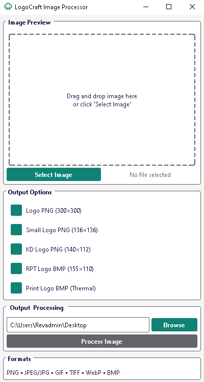

# LogoCraft App

<br />
<div align="center">
  <a href="https://github.com/yourusername/LogoCraft_App">
    
  </a>

  <h3 align="center">LogoCraft App</h3>

  <p align="center">
    A high-performance desktop application for efficient image and logo conversion
    <br />
    <a href="#documentation"><strong>Explore the Documentation »</strong></a>
    <br />
    <br />
    <a href="https://github.com/yourusername/LogoCraft_App/issues">Report Bug</a>
    ·
    <a href="https://github.com/yourusername/LogoCraft_App/issues">Request Feature</a>
  </p>
</div>

## Table of Contents

- [About The Project](#about-the-project)
  - [Built With](#built-with)
- [Getting Started](#getting-started)
  - [Prerequisites](#prerequisites)
  - [Installation](#installation)
- [Usage](#usage)
- [Documentation](#documentation)

## About The Project

<center>
  
</center>


LogoCraft App is a specialized desktop application for professional image processing and logo conversion. Built with Python and PyQt6, it provides a robust platform for handling various image formats, with a focus on maintaining image quality and processing efficiency.

Key Features:

- High DPI support for modern displays
- Multi-format image processing support
- Professional-grade image conversion
- User-friendly graphical interface
- Batch processing capabilities
- Custom output format specifications

### Built With

- Python 3.8+
- Pillow==9.5.0
- PyQt6==6.6.1
- PyQt6-Qt6==6.6.1
- PyQt6-sip==13.6.0

## Getting Started

Follow these steps to set up LogoCraft App locally:

### Prerequisites

- Python 3.8 or higher
- pip package manager

```bash
python -m pip install --upgrade pip
```

### Installation

1. Clone the repository

```bash
git clone https://github.com/yourusername/LogoCraft_App.git
```

2. Create and activate a virtual environment

```bash
python -m venv .venv
source .venv/bin/activate  # On Windows: .venv\Scripts\activate
```

3. Install required packages

```bash
pip install -r requirements.txt
```

4. Launch the application

```bash
python run.py
```

## Usage

LogoCraft App provides a straightforward interface for image processing:

1. Load images via drag-and-drop or file selection
2. Choose desired output formats:
   - Logo (300×300)
   - Small Logo (136×136)
   - KD Logo (140×112)
   - RPT Logo (155×110)
   - Print Logo (Thermal)
3. Select output directory
4. Process images with a single click

Supported Formats:

- PNG
- JPEG/JPG
- BMP
- GIF
- TIFF
- WebP

## Documentation

For detailed information about the application:

- [Installation Guide](INSTALLATION.md) - Complete setup instructions
- [Architecture Documentation](ARCHITECTURE.md) - System design and technical details
