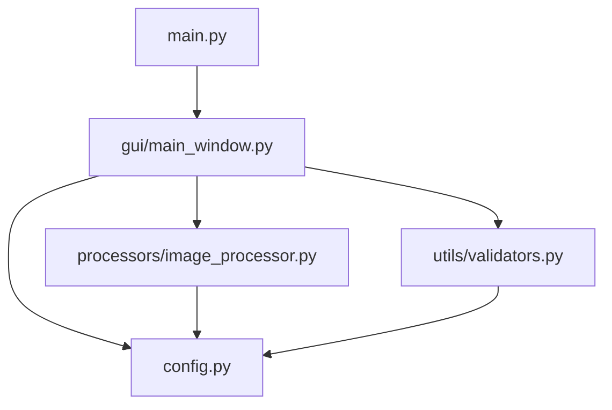

# Repository Map

## Directory Structure
```
LogoCraft_App/
├── src/                      # Source code root
│   ├── __init__.py          # Makes src a Python package
│   ├── main.py              # Application entry point
│   ├── config.py            # Configuration settings
│   ├── gui/                 # GUI components
│   │   ├── __init__.py
│   │   └── main_window.py   # Main window implementation
│   ├── processors/          # Image processing logic
│   │   ├── __init__.py
│   │   └── image_processor.py
│   └── utils/               # Utility functions
│       ├── __init__.py
│       └── validators.py
├── README.md                # Project documentation
└── REPO_MAP.md              # This file
```

## Component Relationships



## Component Descriptions

### 1. Entry Point
- **main.py**
  - Initializes logging
  - Creates GUI instance
  - Starts application

### 2. Configuration
- **config.py**
  - Defines `OutputFormat` class for format specifications
  - Contains `Config` class with:
    - Supported input formats
    - Output format configurations
    - Image processing parameters

### 3. GUI Layer
- **gui/main_window.py**
  - Implements `ImageProcessorGUI` class
  - Manages:
    - Image preview
    - Format selection
    - Directory selection
    - Progress tracking
    - Error handling

### 4. Processing Layer
- **processors/image_processor.py**
  - Implements `ImageProcessor` class
  - Handles:
    - Image loading
    - Format conversion
    - Size adjustments
    - Color mode processing

### 5. Utilities
- **utils/validators.py**
  - Input validation functions
  - File system checks
  - Format verification

## Data Flow

1. User selects input image → `main_window.py`
2. Image loaded and previewed → `image_processor.py`
3. User selects output formats → `main_window.py`
4. Processing triggered → `image_processor.py`
5. Output saved to selected directory

## Key Features Implementation

### Image Preview
```python
# main_window.py
def _update_preview(self, image_path):
    # Load and resize image for preview
    # Display in GUI
```

### Format Processing
```python
# image_processor.py
def process_image(image, format_spec, output_name):
    # Resize image
    # Convert color mode
    # Apply optimizations
```

### Progress Tracking
```python
# main_window.py
def _process_image(self):
    # Update progress bar
    # Handle multiple formats
    # Show completion status
```

## Configuration Example
```python
# config.py
OUTPUT_FORMATS = {
    'Logo.png': OutputFormat(
        dimensions=(300, 300),
        mode='RGBA',
        format='PNG'
    ),
    # ... other formats
}
```